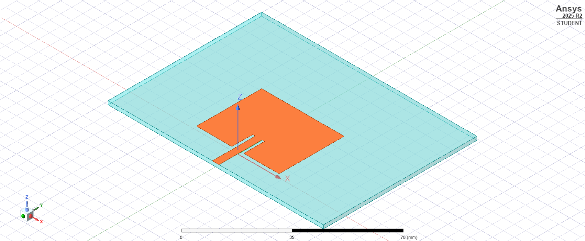
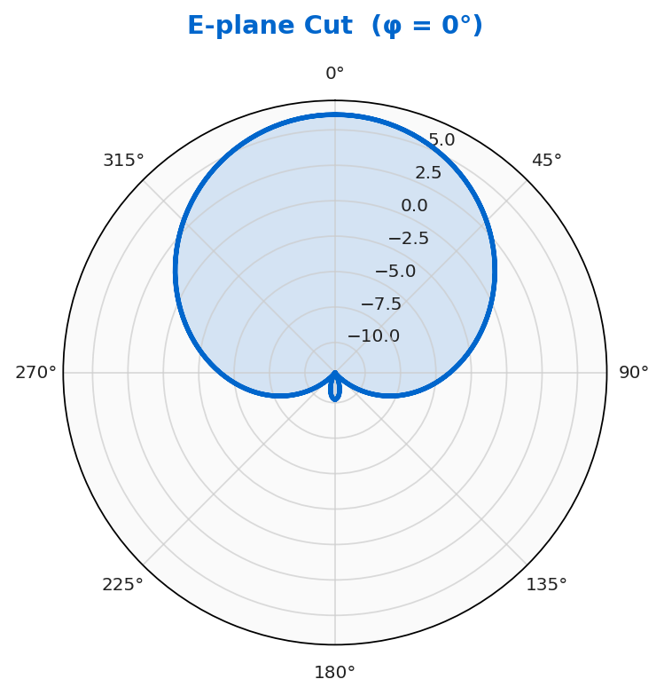
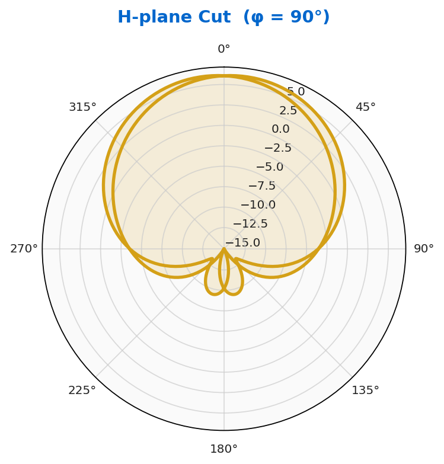
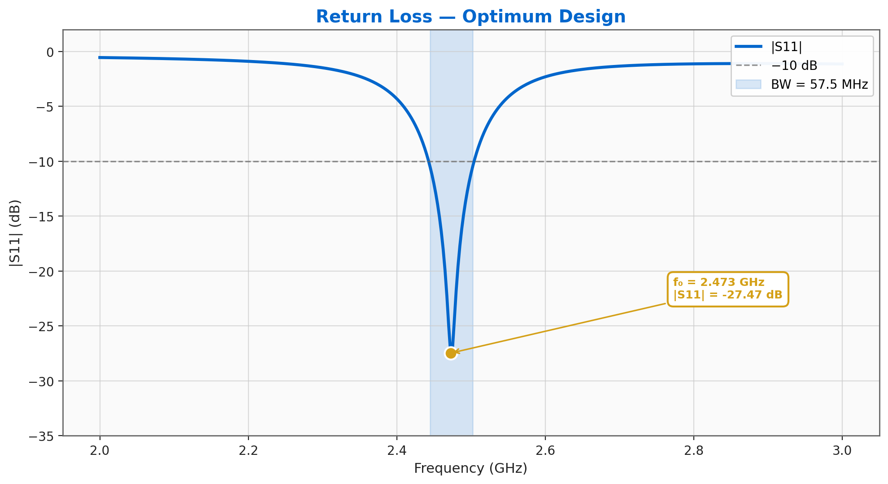
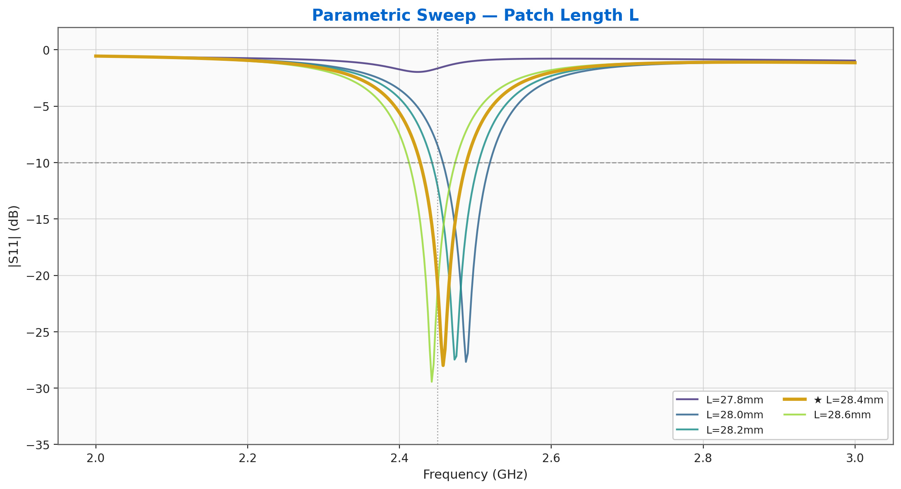

# PyAEDT-Driven Patch Antenna Design

**100% Python · 0% GUI clicks**


<div align="center">

[](https://www.ansys.com)
[](https://github.com/ansys/pyaedt)
[](https://www.python.org)

</div>

---

## The Pitch

This repository demonstrates a complete **RF antenna design workflow** executed entirely in Python using PyAEDT—ANSYS's Python API for electromagnetic simulation. Starting from geometry parameterization, through parametric optimization sweeps, to far-field radiation pattern analysis and automated report generation, this 2.45 GHz inset-fed microstrip patch on FR4 represents production-grade simulation automation. No HFSS GUI clicks required.

---

## 🎯 Key Highlights

- **Center Frequency**: 2.4725 GHz (measured |S₁₁| = −27.5 dB)
- **Realized Gain**: 6.1 dBi at peak direction (±90° from broadside within −3dB)
- **Substrate**: FR4 (εᵣ = 4.4, h = 1.6 mm, tanδ = 0.02)
- **Feed**: Inset microstrip line (direct, no matching network)
- **Automation**: 5-phase pipeline produces geometry, sweeps, fields, animations, and PDF report with zero manual intervention
- **Deliverables**: 8-second MP4 animation + 10-page auto-generated PDF technical report

---

## 📋 How It Works

The design flow runs as a five-phase pipeline:

| Phase | Script | Output |
|-------|--------|--------|
| **1** | Initial Design | AEDT project + parametric geometry |
| **2** | Parametric Sweep | Family of curves (L_patch, W_patch, inset % vars) |
| **3a** | Symmetric Farfield | E/H-plane cuts + 3D radiation patterns |
| **3b** | Combo Animation | 8-second MP4 of antenna geometry rotating with overlaid field heatmaps |
| **4** | PDF Report | 10-page technical report with all metrics, plots, and design narrative |

---

## 🚀 Quickstart

### Prerequisites

- **ANSYS HFSS 2025 R2** or newer (Student Edition supported)
- **Python 3.10+** with PyAEDT 0.26.2
- Windows OS (PyAEDT officially supports Windows for HFSS)

### Installation & Running

```bash
# Clone the repository
git clone https://github.com/kaanevranportfolio/pyaedt-patch-antenna-showcase.git
cd pyaedt-patch-antenna-showcase

# (Optional) Create a virtual environment
python -m venv venv
venv\Scripts\activate

# Install PyAEDT
pip install pyaedt==0.26.2

# Run the full pipeline (5 phases sequentially)
python scripts/01_phase1_initial_design.py
python scripts/02_phase2_parametric_sweep.py
python scripts/03_phase3a_symmetric_farfield.py
python scripts/04_phase3b_combo_animation.py
python scripts/05_phase4_pdf_report.py
```

**Output**:
- `patch_antenna_showcase.mp4` — 8-second rotating antenna animation
- `PyAEDT_showcase_report.pdf` — Full technical report
- `results/` — High-res PNG plots (geometry, S-parameters, radiation patterns)
- `data/` — CSV/NPZ data exports for custom post-processing

<details>
<summary><strong>Expected Runtime & Resources</strong></summary>

- **Phase 1**: 2–3 min (geometry creation + mesh setup)
- **Phase 2**: 10–15 min (parametric sweep, 12 design points)
- **Phase 3a**: 8–10 min (far-field computation)
- **Phase 3b**: 5–7 min (MP4 rendering)
- **Phase 4**: 3–5 min (PDF assembly)
- **Total**: ~30–40 min on modern workstation (RTX 3070 / Ryzen 5900X)

**Disk Space**: ~500 MB (includes AEDT project cache, animation files)

</details>

---

## 🛠 Tech Stack

| Layer | Tool | Version |
|-------|------|---------|
| Simulation Engine | ANSYS HFSS | 2025 R2 |
| Python API | PyAEDT | 0.26.2 |
| CAD/Meshing | HFSS native | 2025 R2 |
| Post-Processing | NumPy, Matplotlib | Latest |
| Report Generation | ReportLab / PDFMiner | Latest |
| Video Rendering | FFmpeg | 5.1+ |
| Language | Python | 3.10+ |

---

## 📖 Full Report

The auto-generated technical report (`PyAEDT_showcase_report.pdf`) includes:

1. **Executive Summary** — Design objectives, antenna class, measured performance
2. **Geometry & Materials** — Parametric CAD overview, substrate stack-up
3. **Meshing Strategy** — Mesh statistics, convergence ratios
4. **Simulation Results** — S₁₁ magnitude & phase vs. frequency, input impedance
5. **Far-Field Analysis** — Radiation patterns (E/H plane cuts), 3D polar plots, directivity/gain tables
6. **Parametric Sweep Summary** — Response surfaces (S₁₁, f₀, gain) vs. design variables
7. **Design Recommendations** — Optimization next steps, frequency tuning guidance
8. **Appendix** — Material properties, mesh convergence plots, script parameters

👉 **[Download the full report (PDF)](PyAEDT_showcase_report.pdf)**

---

## 📊 Gallery

<details>
<summary><strong>Antenna Geometry & Far-Field Pattern</strong></summary>






</details>

<details>
<summary><strong>Parametric Sweep Results</strong></summary>





</details>

---

## 📁 Project Structure

```
pyaedt-patch-antenna-showcase/
├── README.md                          # This file
├── LICENSE                            # MIT License
├── .gitignore
├── PyAEDT_showcase_report.pdf         # Auto-generated 10-page technical report
├── patch_antenna_showcase.mp4         # 8-second rotating antenna animation
├── scripts/
│   ├── 01_phase1_initial_design.py            # Create geometry, meshing setup
│   ├── 02_phase2_parametric_sweep.py          # Sweep across L, W, inset %
│   ├── 03_phase3a_symmetric_farfield.py       # Compute radiation patterns
│   ├── 04_phase3b_combo_animation.py          # Render MP4 animation
│   └── 05_phase4_pdf_report.py                # Generate PDF report
├── results/                           # High-res PNG outputs
│   ├── geometry_clean.png
│   ├── S11_showcase.png
│   ├── phase2_family_of_curves.png
│   ├── eplane_cut.png
│   ├── hplane_cut.png
│   └── hero_frame.png
└── data/                              # Numerical data (CSV, NPZ, JSON, S2P)
    ├── S11_dB.csv
    ├── patch_inset.s2p
    ├── phase2_curves.npz
    ├── phase2_summary.json
    └── farfield_3d.npz
```

---

## ⚙️ Script Parameters & Customization

<details>
<summary><strong>Modify Design Parameters</strong></summary>

Each phase script contains a `DESIGN_PARAMS` dictionary at the top. Common customizations:

```python
# Example: Shift resonant frequency to 5.8 GHz (WiFi 6E band)
DESIGN_PARAMS = {
    'freq_start_ghz': 5.5,
    'freq_stop_ghz': 6.0,
    'freq_points': 201,
    'substrate': 'FR4_1.6mm',  # or 'Rogers4003C', 'RO3003'
    'patch_length_mm': 20.5,   # Adjust patch dimensions
    'patch_width_mm': 24.0,
    'inset_percent': 0.35,
    'sweep_num_points': 12,
}
```

Edit the parameters and re-run any phase; previous results are archived automatically.

</details>

---

## 🔧 Troubleshooting

| Issue | Solution |
|-------|----------|
| `ImportError: No module named 'pyaedt'` | `pip install pyaedt==0.26.2` + ensure HFSS 2025 R2 is installed |
| HFSS/License not detected | Check `ANSYS_EM_USER_INSTALL_PATH` env var; restart PyAEDT session |
| MP4 rendering fails | Verify FFmpeg in PATH: `ffmpeg -version` |
| Out of memory on Phase 2 | Reduce `sweep_num_points` in script parameters |
| PDF generation hangs | Free disk space in `%TEMP%` folder; try Phase 4 in isolation |

---

## 📚 References & Further Reading

- **[PyAEDT GitHub](https://github.com/ansys/pyaedt)** — Official repository & documentation
- **[ANSYS HFSS User Guide](https://www.ansys.com/products/electronics/ansys-hfss)** — Electromagnetic simulation fundamentals
- **[Microstrip Antenna Design (Garg & Bahl)](https://www.amazon.com/Microstrip-Antennas-Design-Characteristics-Applications/dp/0471215368)** — Reference textbook
- **[Parametric Optimization in PyAEDT](https://aedt.docs.pyansys.com)** — Advanced workflows

---

## 👤 Author

**Kaan Evran**  
RF/Microwave Engineer | Simulation Automation  
🔗 [LinkedIn](https://www.linkedin.com/in/kaan-evran-8463a7263) | 💼 [GitHub](https://github.com/kaanevranportfolio)

---

## 📜 License

This project is licensed under the **MIT License** — see [LICENSE](LICENSE) for details.

You are free to use, modify, and distribute this code for educational and commercial purposes. Attribution is appreciated but not required.

---

## 🤝 Contributing

Found a bug? Have a feature idea? Design parameter that produces interesting results?  
Open an issue or submit a pull request. All contributions welcome!

---

**Last Updated**: May 2026 | **HFSS Version**: 2025 R2 | **PyAEDT Version**: 0.26.2
